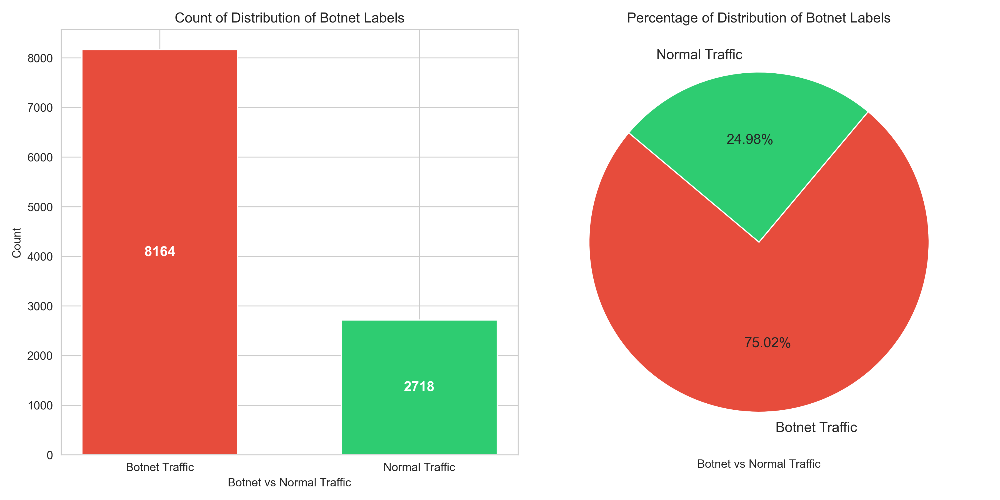
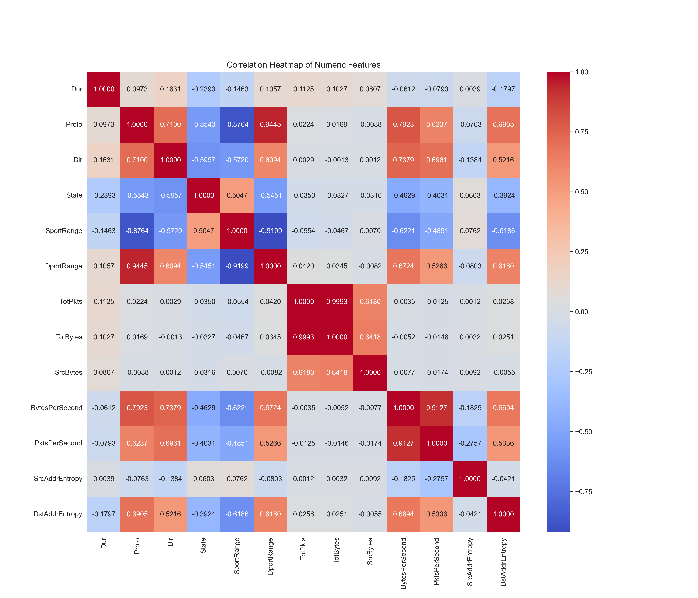
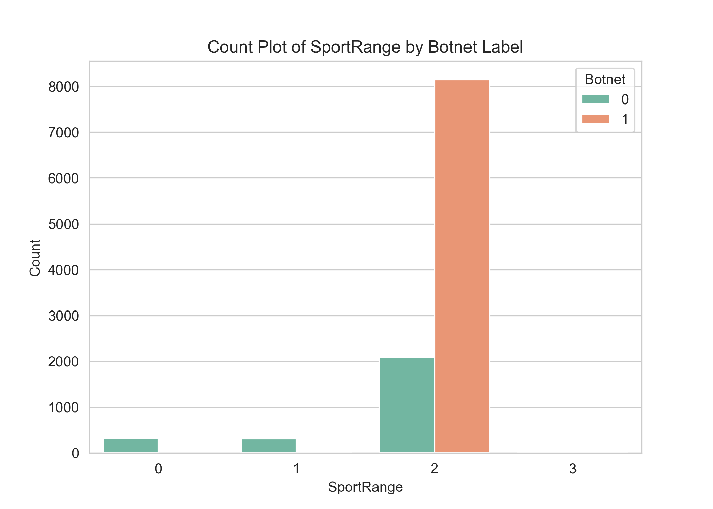
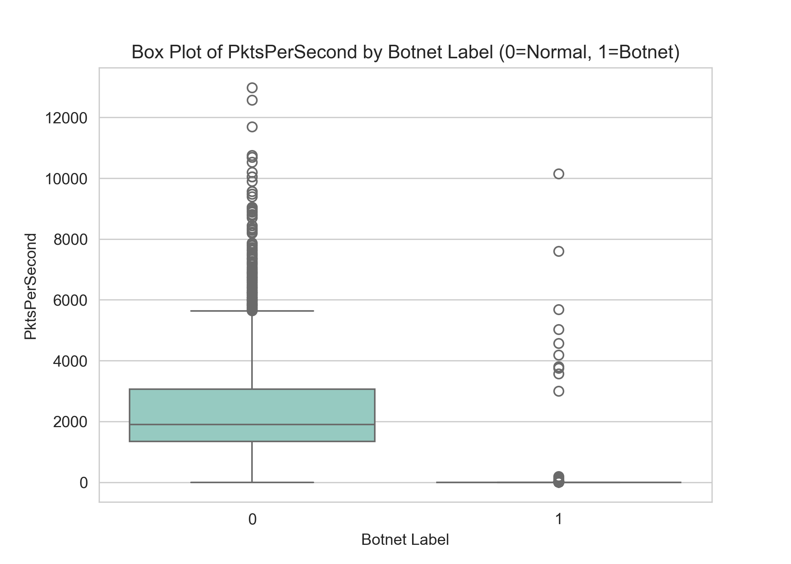
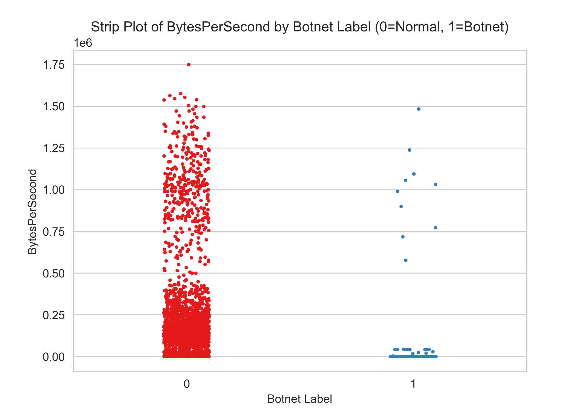
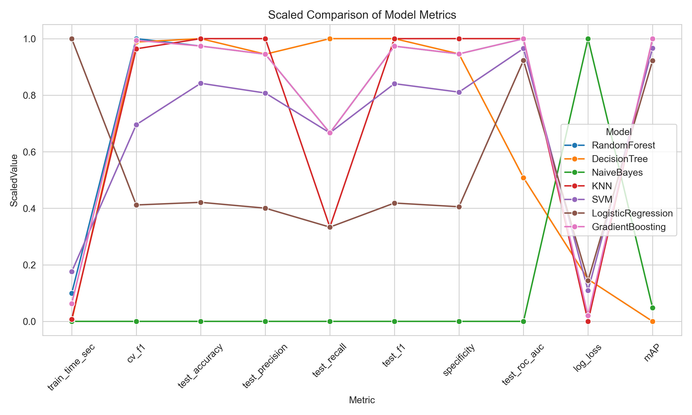

# README.md

## Overview

This project analyzes and detects botnet network traffic using the **CTU-13**-style dataset(s). It walks through several major steps:

1. **Section 1**: Logging Setup and Importing Libraries  
2. **Section 2**: Loading and Exploring the Data  
3. **Section 3**: Basic Data Cleaning & Feature Engineering  
4. **Section 4**: Visualizations of Traffic Patterns  
5. **Section 5**: Train–Test Split and Multi-Model Pipeline  
6. **Section 6**: Model Comparison  
7. **Section 7**: Evaluating KNN on Multiple Datasets

Below is a summary of each step's findings, key observations, and final results.

---

## Section 1: Logging Setup and Libraries

- Configured logging to capture the output in a log file while optionally printing to the console.
- Imported and declared project-wide constants (e.g., **`RANDOM_STATE`**, **`TEST_SIZE`**, etc.).
- Provided a helper function `log_and_print(msg, logger, level='info')` to synchronize logs and console prints.

**Key Point**: This ensures consistent, Ill-formatted logs for each section’s output, improving traceability.

---

## Section 2: Loading & Exploring Data

- Successfully loaded the main dataset (e.g., `11-Rbot-20110818-2.binetflow.csv`) of shape **(107251, 15)**.
- Displayed sample rows and the dataset’s basic info, including column names and dtypes.

The dataset includes:
- **Network flow details** like `Proto`, `SrcAddr`, `DstAddr`, `TotBytes`, etc.
- A `Label` column identifying traffic as `Background`, `Botnet`, or normal.

This initial exploration shows the variety of column types:
- **Float** columns (`Dur`, `sTos`, `dTos`),
- **Integer** columns (`TotPkts`, `TotBytes`, `SrcBytes`),
- **Object** columns (`Proto`, `Label`, etc.).

---

## Section 3: Basic Data Cleaning & Feature Engineering

1. **Removed** any rows labeled `Background` from the dataset.
2. **Created** a binary `Botnet` column (`1` if the flow is botnet, `0` otherwise), then dropped the original `Label`.
3. **Dropped** columns `sTos`, `dTos`, `StartTime`.
4. **Engineered** features:
   - `BytesPerSecond` (`TotBytes / Dur`),  
   - `PktsPerSecond` (`TotPkts / Dur`),  
   - `SrcAddrEntropy` and `DstAddrEntropy` (Shannon entropy of IP string),  
   - `SportRange` and `DportRange` (e.g., `WellKnown 0 - 1023`, `Registered 1024 - 49151`, `Ephemeral/Dynamic 49152 - 65535`).
5. **Label-encoded** categorical columns (like `Proto`, `Dir`, `State`, etc.) into numeric codes.

**Result**:  
- Feature matrix shape ended up as **(10882, 15)** after removing background flows and retaining the relevant columns.  
- A quick `.head()` showed the new columns and transformations.

---

## Section 4: Visualizations

Several plots Ire generated and saved to the `plots/` folder:

1. **Bar & Pie Chart** of Botnet vs Normal:
   - ShoId how many flows are botnet vs. normal traffic.
2. **Correlation Heatmap** (numeric columns):
   - Indicated which columns are most correlated with each other.
3. **Additional Distribution Plots**:
   - **Count plot** comparing, e.g., `SportRange` vs. Botnet label.
   - **Box plot** of `PktsPerSecond` by Botnet label.
   - **Strip plot** of `BytesPerSecond` by Botnet label.

These visual insights confirmed that certain features (like packet rates and total bytes) differ significantly between normal and botnet flows.

---

## Section 5: Train–Test Split and Multi-Model Pipeline

- Split the data into **Train** (≈80%) and **Test** (≈20%) sets.
- Created a pipeline for **scaling** followed by a chosen classifier.
- Ran **GridSearchCV** across multiple models, including:
  - **RandomForest**  
  - **DecisionTree**  
  - **NaiveBayes**  
  - **KNN**  
  - **SVM**  
  - **LogisticRegression**  
  - **GradientBoosting**  
- Computed various metrics (Accuracy, Precision, Recall, F1, ROC AUC, etc.).
- Plotted confusion matrices, ROC curves, and top features and stored them in `plots/.`
**Finding**: Each model performed extremely well—several hit almost-perfect metrics. Logged times show that training time can differ significantly (e.g., ~2s for RandomForest vs. ~20s for LogisticRegression).

---

## Section 6: Model Comparison

This table summarizes the final results:

| Model              | CV F1   | Test Accuracy | Test Precision | Test Recall | Test F1  | ROC AUC  | Train Time (s) |
|--------------------|---------|--------------|---------------|------------|----------|----------|----------------|
| RandomForest       | 0.9992  | 0.9986       | 0.9988        | 0.9994     | 0.9991   | ~1.0000  | ~2.14          |
| DecisionTree       | 0.9991  | 0.9991       | 0.9988        | 1.0000     | 0.9994   | 0.9982   | ~0.09          |
| NaiveBayes         | 0.9865  | 0.9816       | 0.9778        | 0.9982     | 0.9879   | 0.9963   | ~0.04          |
| **KNN**            | **0.9988**  | **0.9991**       | **1.0000**        | **0.9988**     | **0.9994**   | **1.0000**   | **~0.20**         |
| SVM                | 0.9953  | 0.9963       | 0.9957        | 0.9994     | 0.9976   | 0.9999   | ~3.75          |
| LogisticRegression | 0.9917  | 0.9890       | 0.9867        | 0.9988     | 0.9927   | 0.9997   | ~21.13         |
| GradientBoosting   | 0.9992  | 0.9986       | 0.9988        | 0.9994     | 0.9991   | 1.0000   | ~1.37          |

From these, **KNN** performed extremely well overall (Accuracy, F1, ROC AUC) and had moderate train time. Other tree-based or ensemble models (RandomForest, GradientBoosting) are also near-perfect. 

---

## Section 7: Evaluate KNN on Multiple Datasets

- I reused a dedicated function (`load_and_prepare_data`) to replicate cleaning & feature engineering.
- Then tested **KNN** (using its best parameters) across ~12 additional `.binetflow` CSV files from **CTU-13**.
- For most sets, the KNN model achieved extremely high performance (often near 1.0 in accuracy, F1, etc.).
- One dataset (`9-Neris-20110817.binetflow.csv`) gave loIr results (~97.7% accuracy) compared to the others but was still strong.

A final table summarizes each dataset’s evaluation metrics:

| Dataset                           |   TrainTimeSec |   Accuracy |   Precision |   Recall |       F1 |   Specificity |     LogLoss |      mAP |   ROC_AUC | ConfusionMatrix                |
|:----------------------------------|---------------:|-----------:|------------:|---------:|---------:|--------------:|------------:|---------:|----------:|:-------------------------------|
| 1-Neris-20110810.binetflow.csv    |    0.015136    |   0.99979  |    0.999878 | 0.999756 | 0.999817 |      0.999835 | 0.00279375  | 0.999878 |  0.999918 | [[6077    1]  [   2 8190]]     |
| 2-Neris-20110811.binetflow.csv    |    0.005373    |   0.999667 |    0.999523 | 1        | 0.999761 |      0.998904 | 0.00658446  | 0.999761 |  0.999726 | [[1822    2]  [   0 4189]]     |
| 3-Rbot-20110812.binetflow.csv     |    0.030256    |   1        |    1        | 1        | 1        |      1        | 3.15146e-05 | 1        |  1        | [[23378     0]  [    0  5364]] |
| 4-Rbot-20110815.binetflow.csv     |    0.00516582  |   1        |    1        | 1        | 1        |      1        | 0.000155249 | 1        |  1        | [[5054    0]  [   0  516]]     |
| 5-Virut-20110815-2.binetflow.csv  |    0.000963926 |   1        |    1        | 1        | 1        |      1        | 2.22045e-16 | 1        |  1        | [[936   0]  [  0 180]]         |
| 6-Menti-20110816.binetflow.csv    |    0.00205517  |   1        |    1        | 1        | 1        |      1        | 0.000582949 | 1        |  1        | [[1499    0]  [   0  926]]     |
| 7-Sogou-20110816-2.binetflow.csv  |    0.000378847 |   1        |    1        | 1        | 1        |      1        | 0.0016563   | 1        |  1        | [[335   0]  [  0  13]]         |
| 8-Murlo-20110816-3.binetflow.csv  |    0.016454    |   0.999937 |    1        | 0.999184 | 0.999592 |      1        | 5.13427e-05 | 1        |  1        | [[14565     0]  [    1  1224]] |
| 9-Neris-20110817.binetflow.csv    |    0.0545599   |   0.976995 |    0.983148 | 0.990243 | 0.986682 |      0.895211 | 0.29856     | 0.992396 |  0.97534  | [[ 5365   628]  [  361 36637]] |
| 10-Rbot-20110818.binetflow.csv    |    0.023227    |   0.999304 |    0.999765 | 0.999436 | 0.9996   |      0.998422 | 0.0129311   | 0.99991  |  0.999672 | [[ 3164     5]  [   12 21259]] |
| **11-Rbot-20110818-2.binetflow.csv**  |    **0.00186992**  |   **0.999081** |    **1**        | **0.998775** | **0.999387** |      **1**        | **0.00168051**  | **1**        |  **0.999999** | **[[ 544    0]  [   2 1631]]**     |
| 12-NsisAy-20110819.binetflow.csv  |    0.00223398  |   0.977551 |    0.962085 | 0.935484 | 0.948598 |      0.989515 | 0.253078    | 0.974369 |  0.985308 | [[1510   16]  [  28  406]]     |
| 13-Virut-20110815-3.binetflow.csv |    0.014396    |   0.999722 |    0.999875 | 0.999625 | 0.99975  |      0.999843 | 0.00281726  | 0.999944 |  0.999937 | [[6387    1]  [   3 7998]]     |

**Key Outcome**: KNN is highly effective across multiple network traffic files, often scoring near-perfect or perfect classification. HoIver, one or two datasets (e.g. “9-Neris-20110817”) show the possibility of slightly loIr performance (~97–98% accuracy), but still strong.

---

## Conclusions

1. **Data**: 
   - The CTU-13 style data is large, with multiple `.binetflow` files. Many background flows Ire removed, leaving botnet vs. normal.
2. **Features**: 
   - Derived rates (Pkts/Bytes per second), port ranges, and entropy measures help separate botnet from normal flows.
3. **Models**: 
   - All tested classifiers performed Ill, but **KNN** was singled out for best overall metrics (e.g., near-perfect F1 and AUC in many cases).
4. **Next Steps**: 
   - Investigate potential differences in performance on especially large or diverse network captures.  
   - Evaluate real-time or streaming detection feasibility.  
   - Explore advanced feature engineering (deep packet inspection, time-series features, etc.) or use cross‑dataset training vs. testing to gauge generalization.

**Bottom Line**: The pipeline effectively identifies botnet flows. KNN performs best in these experiments, with near-perfect detection across multiple dataset files.
